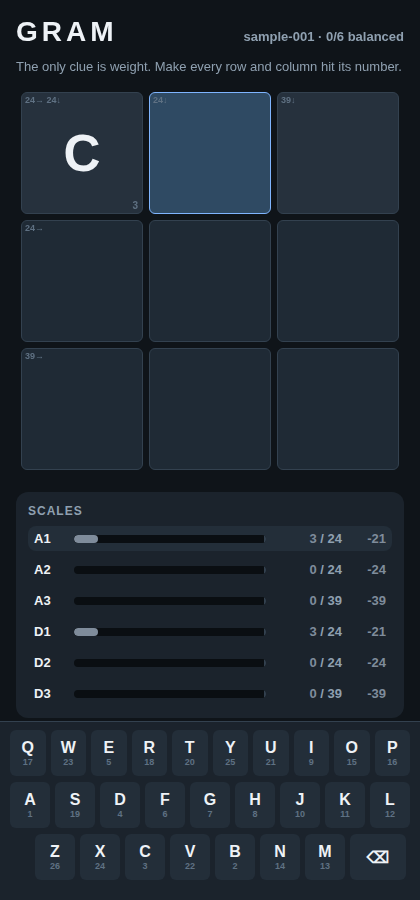
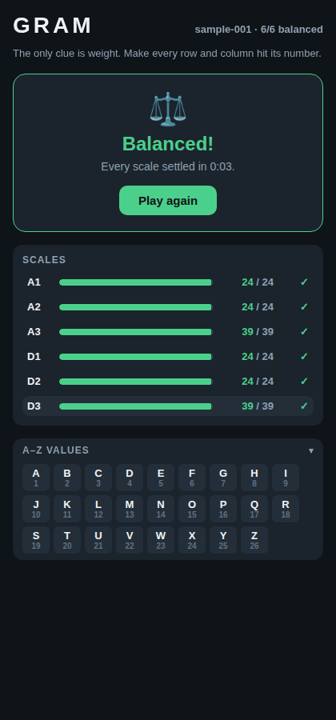

# GRAM — a daily word puzzle where the only clue is weight

Each letter is worth its place in the alphabet (`A=1 … Z=26`). A word's **weight**
is the sum of its letters (`CAT = 3+1+20 = 24`). You fill an interlocking grid
where the only clue for each entry is a single number — its target weight. You
win when **every entry is a real word AND every entry's letters sum to its target.**

This is the MVP client (steps 1–3 of the build plan), built with **Expo /
React Native** so it runs on iOS, Android, and the web from one codebase.

 

## What's built

- **A–Z value model** — `src/model/letters.ts` (`letterValue`, `wordWeight`).
- **Grid renderer + custom input** — tap a cell, type on the on-screen keyboard
  (each key shows its point value). Re-tap an intersection to flip
  across/down. Anchors are locked.
- **Live "Open mode" feedback** — the *Scales* panel shows each entry's running
  sum vs. its target with a balance bar and delta, coloring toward green as it
  settles. Target weights also appear as crossword-style badges on the grid.
- **Offline dictionary validation** — `src/model/dictionary.ts` checks fills
  against a bundled 55k-word list (`src/model/dictionary.words.ts`).
- **Win detection** — `isPuzzleSolved` requires every entry to be filled,
  balanced, *and* a valid word. Solving shows the balance banner + solve time.
- Runs against the hardcoded sample puzzle (`src/model/samplePuzzle.ts`,
  solution `CAT / ARE / TEN`).

## Run it

```bash
cd gram
npm install
npm run web      # play in a browser
npm run ios      # or: npm run android  (Expo Go / simulator)
```

## Test & verify

```bash
npm test         # model unit tests (letters, sums, win detection, dictionary)
npm run typecheck
```

The play loop is also verified end-to-end: exporting the web build and driving
it with a headless browser types the solution and reaches the win state (the
screenshots above are captured from that run).

## Project layout

```
src/
  model/
    letters.ts          A–Z values + word weight
    types.ts            Puzzle/Entry/Anchor JSON shapes (match the spec)
    samplePuzzle.ts     the hardcoded sample-001 puzzle
    dictionary.ts       offline word validation
    dictionary.words.ts bundled word list (generated)
    gameState.ts        fill state, per-entry status, win detection, grid index
  components/           Cell, Board, ScalePanel, Keyboard, ValueChart, WinBanner
  screens/GameScreen.tsx  wires input, timer, and feedback together
scripts/generate-dictionary.mjs   regenerates the bundled word list
```

## Not built yet (later MVP steps)

Offline puzzle generator + uniqueness solver (step 4), Netlify daily delivery
(step 5), streaks/share string (step 6), onboarding (step 7), and Blind/Hard
mode with weighings (step 8). The puzzle JSON shape and dictionary are already
in place so these slot in without reworking the client.

## Dictionary provenance

`dictionary.words.ts` is generated from the public-domain
[dwyl/english-words](https://github.com/dwyl/english-words) list, filtered to
lengths 2–6 and uppercased. Regenerate with `node scripts/generate-dictionary.mjs`.
The client dictionary is intentionally broad ("is this a real word?"); puzzle
*uniqueness* is the generator's job, not the client's.
